# The IsBin application

This application allows users to add books to their favorite list, view books in detail, search for isbns and authors.
It also allows administrators to add books to the database. A user can register and login to the application. 
Depending on the role of a user he or she has access to different parts of the application.

## TL;DR
1. This application runs online on [isbin.qwict.com](https://isbin.qwict.com)
2. The trello-page for this application can be found here: [trello.com/isbin-application](https://trello.com/b/5xWz5DxY/isbin-application)
3. A diagram representing the ERD of database can be found here: [drawsql.app/teams/qwict/diagrams/isbin](https://drawsql.app/teams/qwict/diagrams/isbin)
4. Requirements
	1. java openjdk 17.0.5 or later
	2. Apache Maven 3.9.1 or later
	3. A MySQL server with an empty schema (with SSL for production)
5. To install it: 
	1. clone
	2. create and fill in application.properties in `/src/main/resources`
	3. from the root build to jar with `maven install`
	4. from the root run the jar with `java -jar target/IsBin.jar`
	5. the application should start; go to [localhost:9091](http://localhost:9091) or whatever port you use.

## Requirements
1. Java openjdk 17.0.5 or later
2. Apache Maven 3.9.1 or later
3. A MySQL server with an empty schema (with SSL for production)

## Installation
1. Clone the repository to your device: ```
```sh
git clone https://github.com/JorisVanDuyseHogent/IsBin.git
```
2. Create or rename `application.properties.example` to the required `application.properties` file in `/src/main/resources/application.properties`, remember to replace all {text} with your information curly brackets included :)
```sh
# ------------- Development settings ------------
spring.datasource.url=jdbc:mysql://localhost:3306/{your_database_name}?serverTimezone=UTC
spring.datasource.username={your_database_username}
spring.datasource.password={your_database_password}
application.port={the_port_for_your_application}  
application.env=development
spring.jpa.generate-ddl=true  
spring.jpa.hibernate.ddl-auto=create-drop
spring.messages.basename=i18n/messages  

# ------------- Production settings --------------
# ----- Uncomment these to run in procution! -----
# ------ And remove the developer settings! ------
#spring.datasource.url=jdbc:mysql://{example.com}/{your_production_database_name}?#useSSL=true&requireSSL=true&serverTimezone=UTC
#spring.datasource.username={your_production_database_username}
#spring.datasource.password={your_production_database_password}
#application.port={the_port_for_your_production_application}
#application.env=production
#spring.jpa.hibernate.ddl-auto=none
#spring.messages.basename=i18n/messages
```
3. Run the application from your favorite IDE. I will not explain this, because it is very different for each developer and operation system.
4. Build the application to jar with from the root of the git repository (this is where the pom.xml is located):
```sh
mvn install
```
5. Run the application also from the root with (If the database schema was already used, you will get foreign key constraint errors, but you can ignore these, will only happen with development settings):
```sh
java -jar target/IsBin.jar
```

## Running in development versus running in production
There is no big difference between running with the in development and running in production except for that in development, the database schema will be dropped after every restart and the database will be seeded with books and users. 
Recommended for production: start the application one time in development; this will seed the database with some books and users. After that enable all the production settings in the application.properties file and remove the developer settings. Reinstall the application with maven to jar and run the jar again with java. 
This way you will have a production server with some books, authors and users already in the database.

## Seeded Users and data
When starting in development, the database will be seeded by the file: `com/qwict/isbin/repository/seeds/InitDataConfig.java`.
This seeding script will create three Users with different Roles:
1. owner@qwict.com with `password: owner@qwict.com`
2. admin@qwict.com with `password: admin@qwict.com`
3. user@qwict.com with `password: user@qwict.com`

> This means that after startup in development, you can use these accounts to test the different roles. The owner is able to change passwords. So if you want to run this page on the internet, make sure to change the passwords first!

It will also add Books to the database, all these Books have Authors which will also be added, and some Books have Users that liked them (which makes the most-popular page work). Some Locations will also be created.

## IsBin database
In the IsBin database there are 4 tables:
1. The book table
   1. The book_author table
   2. The book_user table
2. The author table
   1. The author_book table
3. The user table
   1. The user_book table
   2. The user_role table
4. The role table

Users are saved in the database with an encrypted password; the password is encrypted with BCrypt.

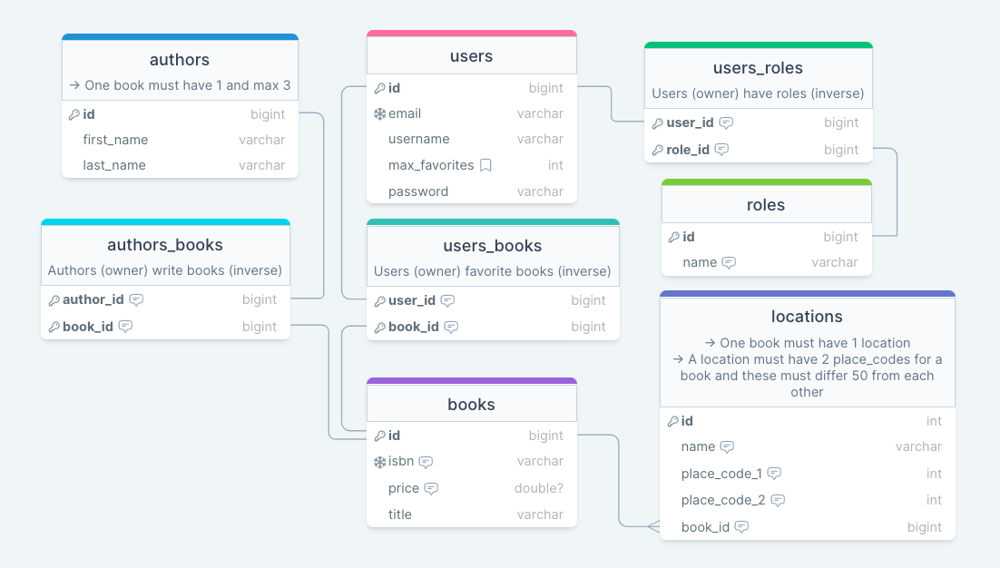

## Screenshots
> An example of the detailpage for a book (The Art of War).

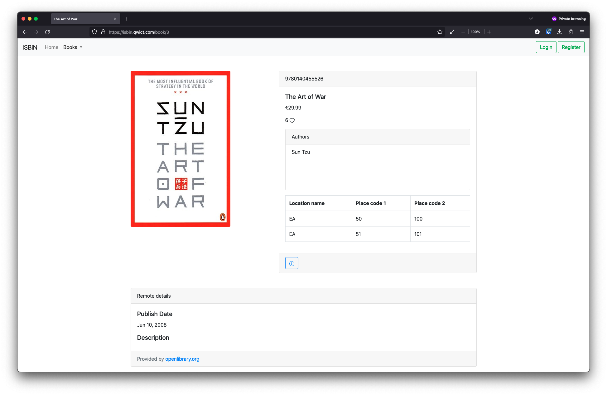

> The IsBin home page with info about different roles.

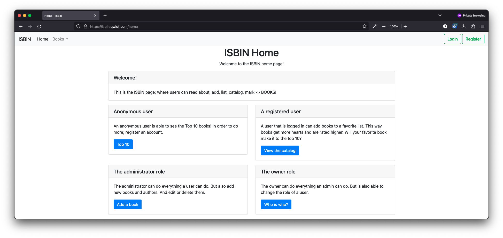

> Most popular books ordered by number of "hearts". 

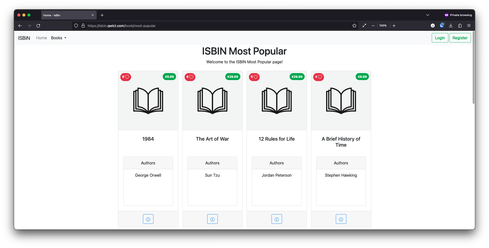

> The registration page; registration is required to view the catalog

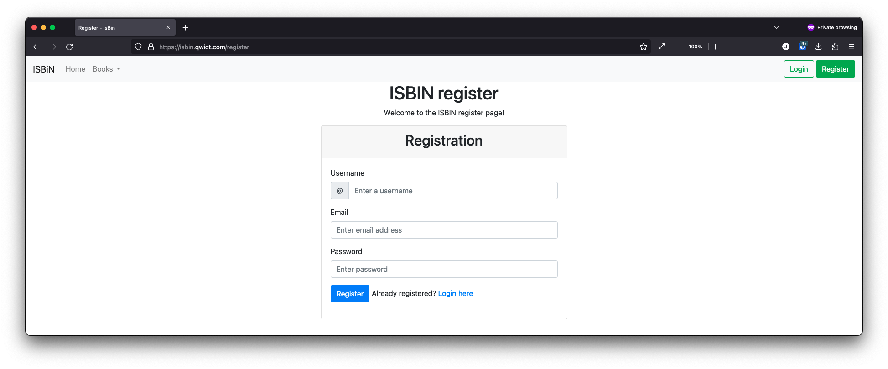

> The favorites page available for users 

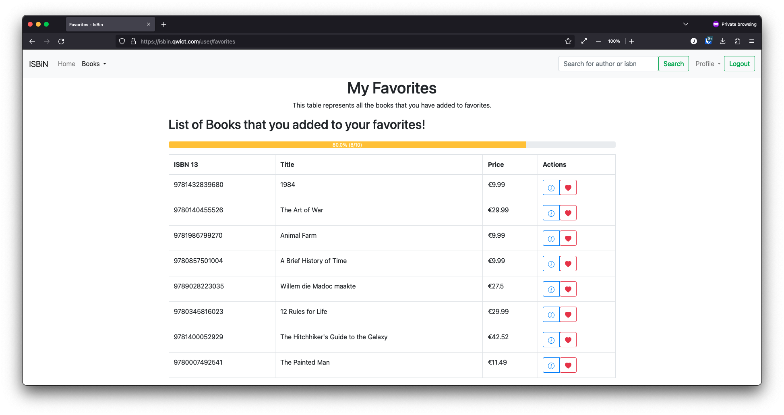

> The search page that supports author lookup by first and lastname, but also isbn lookup 

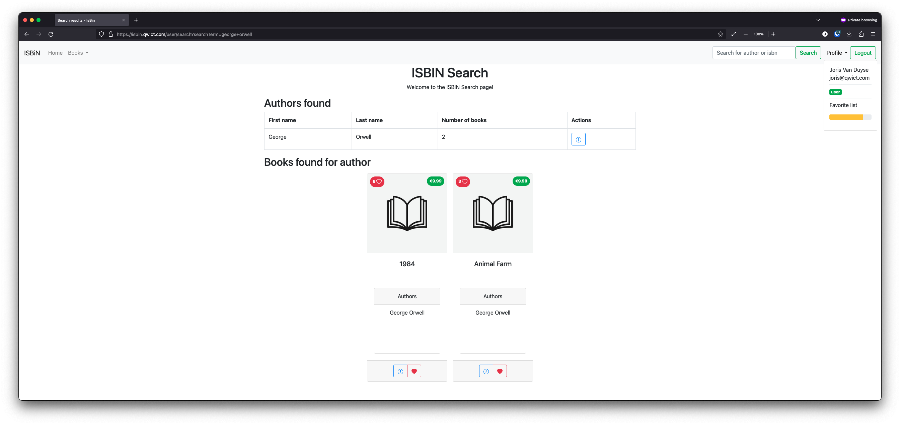

> The book form that allows administrators to add books to the catalog; in this case the administrator tried to submit a book without filling in any information.

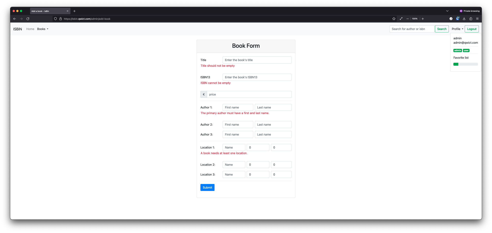

### The navigation bar
> The right side of the navigation bar with a normal user logged in.

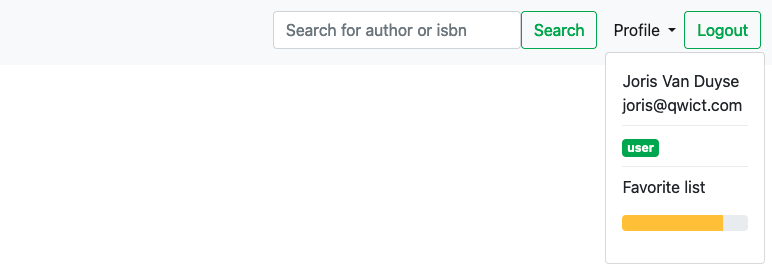

> The left side of the navigation bar with the owner logged in.

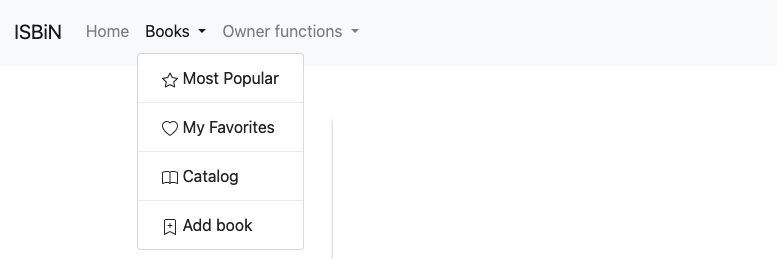


## REST
### Get request voor health van de server
> To get information about the spring boot application you can [GET /api/public/health/version](https://isbin.qwict.com/api/public/health/version)

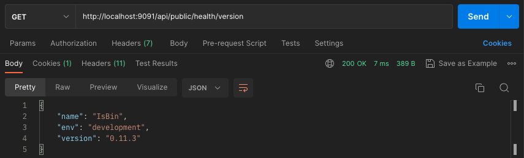

### Get request for author
> Call [GET /api/public/author/george/orwell](https://isbin.qwict.com/api/public/author/george/orwell)  to look up a specific author by entering their first and last name; This will return a JSON

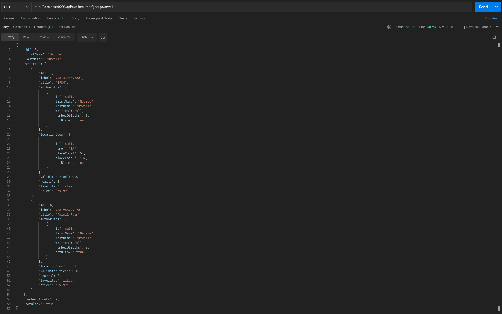

### Get request for a book
> By calling [GET /api/public/book/9780140455526](https://isbin.qwict.com/api/public/book/9780140455526) it is possible to look up a book by its isbn number.

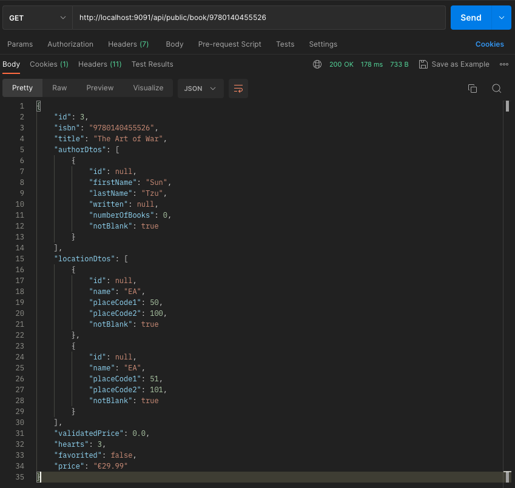

## Tests
### ApiControllerTest
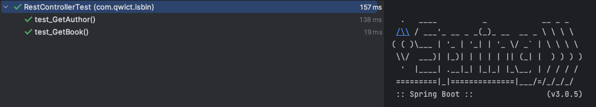

> The GetBook() test runs the [GET /api/public/book/{isbn}](https://isbin.qwict.com/api/public/book/9780140455526) 
> endpoint and checks if the status is OK. It also checks if the bookServiceMock is called with the correct isbn number.
```java
@Test
public void test_GetBook() throws Exception {
	MockitoAnnotations.openMocks(this);
	apiController = new ApiController();
	mockMvc = standaloneSetup(apiController).build();
	ReflectionTestUtils.setField(apiController, "bookService", bookServiceMock);
	Book book = new Book("9780201633610", "Design Patterns", 28.99);
	Mockito.when(bookServiceMock.findBookByIsbn("9780201633610")).thenReturn(book);
	mockMvc.perform(MockMvcRequestBuilders.get("/api/public/book/9780201633610")).andExpect(status().isOk());
	Mockito.verify(bookServiceMock).findBookByIsbn("9780201633610");
	mockMvc.perform(MockMvcRequestBuilders.get("/api/public/book/9780201633610"))
			.andExpect(status().isOk());
}
```

> The GetAuthor() test runs the [GET /api/public/author/{firstName}/{lastName}](https://isbin.qwict.com/api/public/author/george/orwell) 
> endpoint and checks if the status is OK. It also checks if the authorServiceMock is called with the correct first and last name.
```java
@Test
public void test_GetAuthor() throws Exception {
	MockitoAnnotations.openMocks(this);
	apiController = new ApiController();
	mockMvc = standaloneSetup(apiController).build();
	ReflectionTestUtils.setField(apiController, "bookService", bookServiceMock);
	ReflectionTestUtils.setField(apiController, "authorService", authorServiceMock);
	ReflectionTestUtils.setField(apiController, "authorRepository", authorRepositoryMock);

	Book book = new Book("9780201633610", "Design Patterns", 28.99);
	Mockito.when(bookServiceMock.findBookByIsbn("9780201633610")).thenReturn(book);
	bookServiceMock.mapToBookDto(book);

	Author author1 = new Author("Erich", "Gamma");
	author1.setWritten(List.of(book));
	Author author2 = new Author("Richard", "Helm");
	author2.setWritten(List.of(book));
	Author author3 = new Author("Ralph", "Johnson");
	author3.setWritten(List.of(book));
	Mockito.when(authorRepositoryMock.saveAll(List.of(author1, author2, author3))).thenReturn(List.of(author1, author2, author3));

	AuthorDto author1Dto = authorServiceMock.mapToAuthorDto(author1);
	Mockito.when(authorServiceMock.getByFirstNameAndLastName("Erich", "Gamma")).thenReturn(author1Dto);
	mockMvc.perform(MockMvcRequestBuilders.get("/api/public/author/Erich/Gamma")).andExpect(status().isOk());

	Mockito.verify(authorServiceMock).getByFirstNameAndLastName("Erich", "Gamma");
}
```
